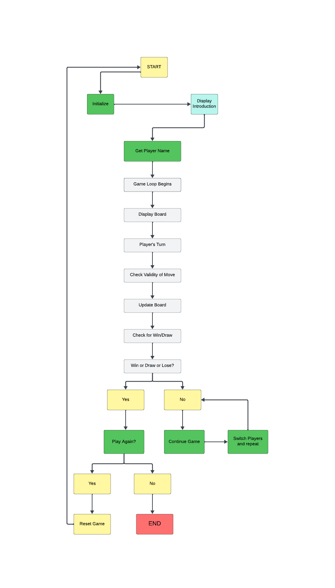

# tic-tac-toc-p3

## Flowchart ##

 The Tic-Tac-Toe game begins by asking the player to choose between X or O, after which both the player and computer take turns making moves. 

The flowcharts on the left demonstrate the series of events that occur during the player's turn, while the ones on the right represent what takes place during the computer's turn. Once the player or computer has made a move, the program checks whether they have won or caused a tie, and then switches turns. 

After the game is complete, the program prompts the player to decide whether they would like to play again.