# Tic-Tac-Toe

## Introduction ##

Are you up for a game of Tic Tac Toe against a computer? It's a timeless game where two players take turns marking spaces in a 3x3 grid. The objective is to be the first to align three of your marks horizontally, vertically, or diagonally.

In this digital version of the game, you'll be playing against an AI opponent represented by '😠', while you'll be '❌'. To play, you just need to strategically place your mark in an empty cell by entering a number from 1 to 9, corresponding to the position on the board.

Here are the game rules:

- The first player to get three of their marks in a row, column, or diagonal wins.
- If all the cells are filled without any player achieving three in a row, the game ends in a draw.

Get ready to exercise your tactical skills and experience the thrill of victory in this classic game of Tic Tac Toe!

## AM I Responsive ##

Here's your deployed site as an example:
[Am I Responsive](https://ui.dev/amiresponsive?url=https://tic-tac-toc-5757397cee14.herokuapp.com)

## Live Project ##

View the live project here: [Tic Tac Toe](https://tic-tac-toc-5757397cee14.herokuapp.com/)

## Design ##

### Colours ###

These colours are implemented using the Colorama library in Python, which allows for easy cross-platform coloured text output in the console. You can customize the colours or add more as per your preference by modifying the code.

- ### Green: ###
Used for the welcome message and player prompts.
- ### Yellow: ###
Used for game instructions and important information about the game.
- ### Cyan: ###
Used for displaying the Tic Tac Toe board and numerical grid positions.
- ### Red: ###
Used for error messages or warnings.

- [How to Print Colored Text in Python](https://www.youtube.com/watch?v=u51Zjlnui4Y)
- [colorma 0.4.6](https://pypi.org/project/colorama/)

### Emoji ###

The Tic Tac Toe Emojis package provides emojis for the game and allows them to be applied to text in the terminal.

[Emoji](https://emojidb.org/tic-tac-toe-emojis)

## Flowchart and Python coding ##

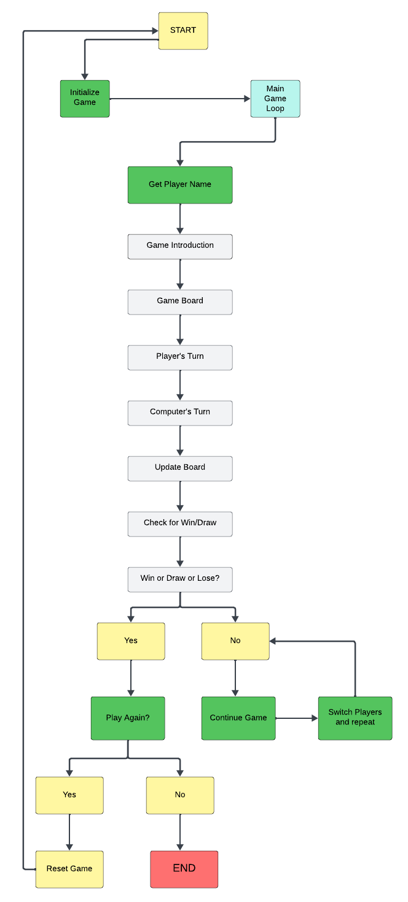

- ### Start: ###
    This is the beginning stage of the Tic Tac Toe game.

    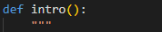

- ### Initialize Game: ###
    During game initialization, the environment is prepared, which includes setting up the game board and variables.

    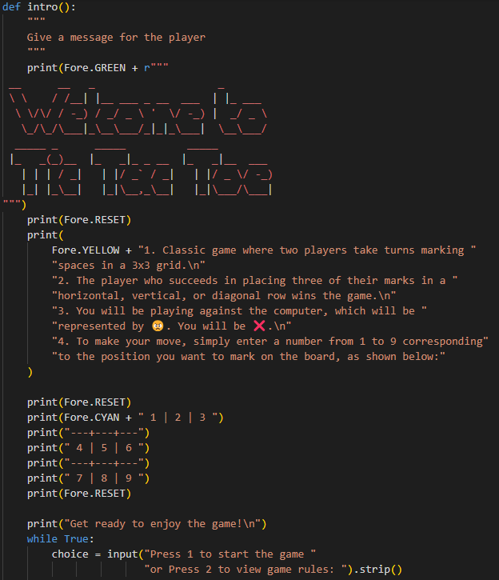

- ### Main Game Loop: ###
    The main game loop runs until the game ends.

    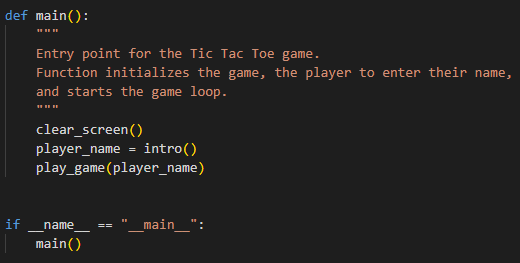

- ### Get Player Name: ###
    The player is to enter their name.

    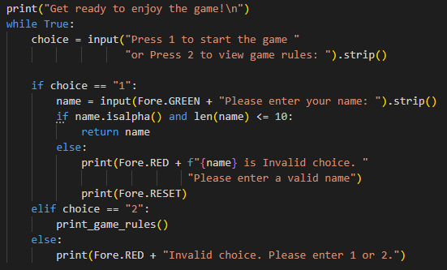

- ### Game Introduction: ###
    Display the game introduction with rules and instructions to the player.

    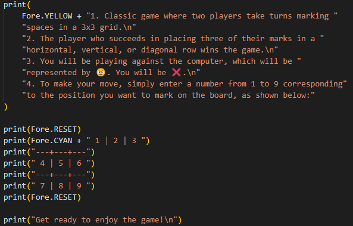

    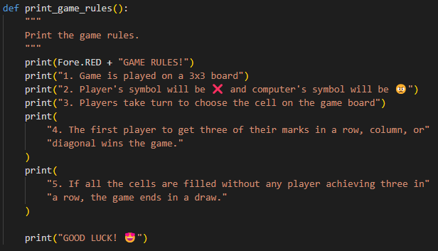

- ### Game Board: ###
    Show the game board status to the player.

    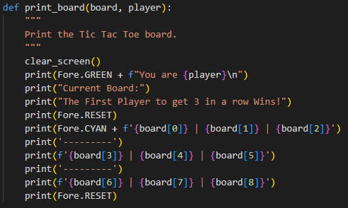

- ### Player's Turn: ###
    Player's turn. Place ❌ or 😠 in an unoccupied spot.

    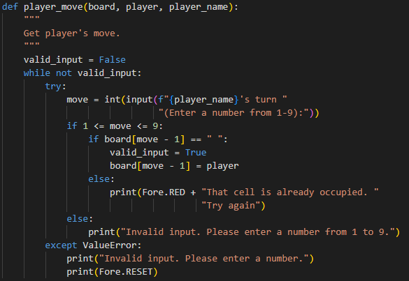

- ### Update Board: ### 
    The computer's move updates the game board.

    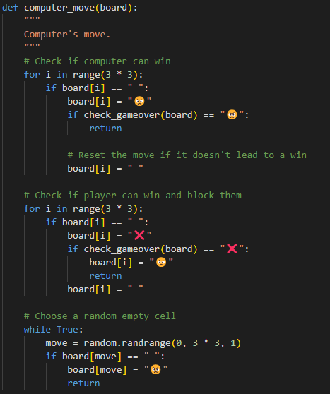

- ### Check for Win/Draw: ###
    The program checks for a win by either a player or a draw.

    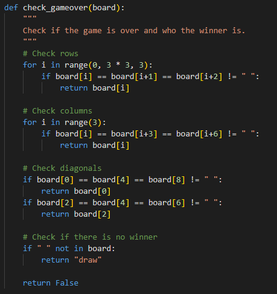

- ### Win or Draw: ###
    If the game ends in a win or draw, this step handles the outcome.

    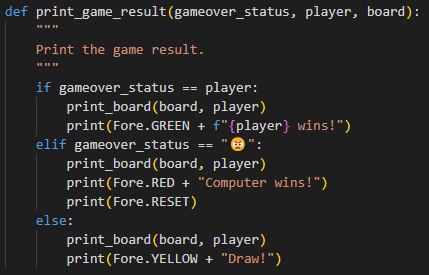

- ### Play Again?: ###
    After the game ends, players can choose to restart from the beginning.

    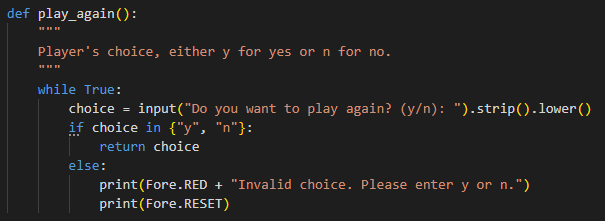

- ### Continue Game: ###
    Players switch turns if the game continues.(Look at flowchart)

- ### Switch Players: ###
    Players must take turns making moves.(Look at flowchart)

- ### Computer's Turn: ###
    The program calculates the computer's move based on a predetermined strategy during its turn. (Look at flowchart)

- ### Update Board: ###
    The game board is updated after the computer's move, like the player's turn. (Look at flowchart)

- ### Check for Win/Draw: ###
    Checks if either player won or if it's a draw. (Look at flowchart)

- ### Win or Draw: ###
    Handle the outcome when a player wins or the game ends in a draw. (Look at flowchart)

- ### Play Again?: ### 
    Players can choose to play again once the game is over. (Look at flowchart)

- ### End: ### 
    The flowchart ends here and so does the Tic Tac Toe game.

    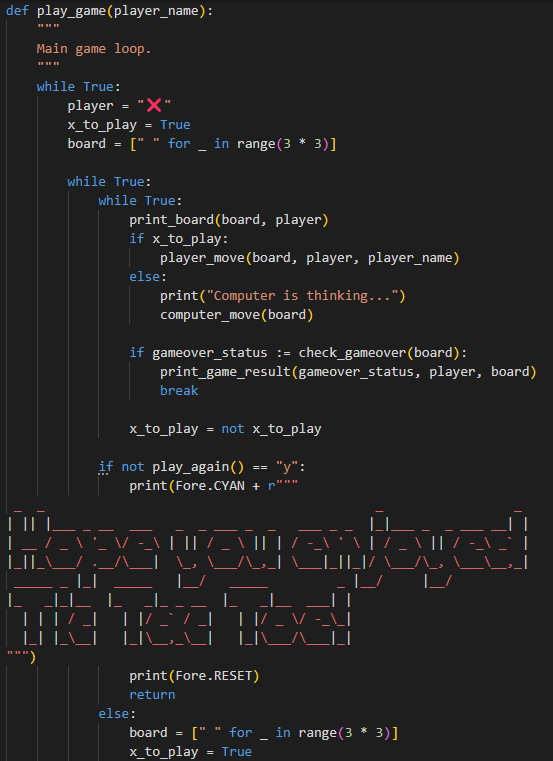

## Features ##

### Welcome Message and Introduction: ###

- At the game's start, a stylish header appears along with a brief introduction to the rules and mechanics.
- The system prompts the user to choose between two options: Press 1 to start the game or Press 2 to view the game rules. The system also requests the user's name, ensuring that only alphabetic characters are accepted.

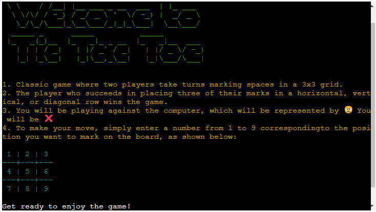

### Printing the Game Board: ###

- The 'print_board()' function displays the current state of the Tic Tac Toe game board to the player.
- It shows the positions on the board with numbers for player reference.

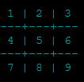

### Game Logic: ###

- The function checks the board state to determine the winner or if it's a draw and if the game is over. 
- It checks for winning conditions in rows, columns, and diagonals, as well as for a draw condition.

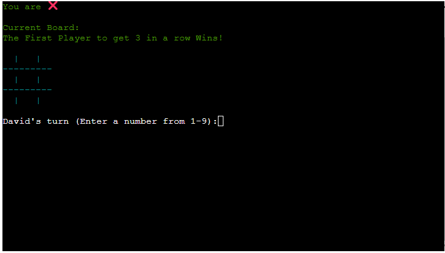

### Game Rules: ###

- Displays the set of rules of the game

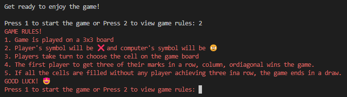

### Computer Move: ###

- This function is responsible for executing the logic that determines the computer player's move.
- After checking if the computer can win on its next move, if not, it blocks the player from winning, and if neither, it makes a random move.

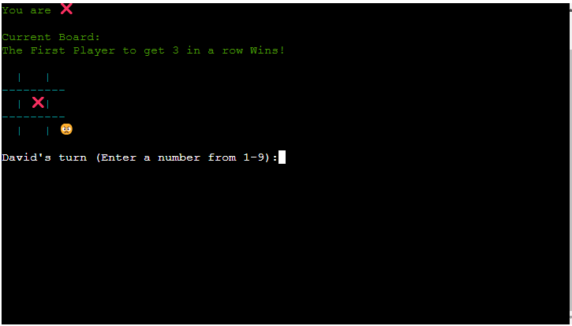

### Main Game Loop ###

- The main() function is responsible for managing the game's flow.
- It prompts the player for their name, displays the introduction, and begins a new game repeatedly.
- Each game consists of alternating, player and computer turns until a win or draw.
- At the end of every game, the system prompts the player to ask if they would like to play again.

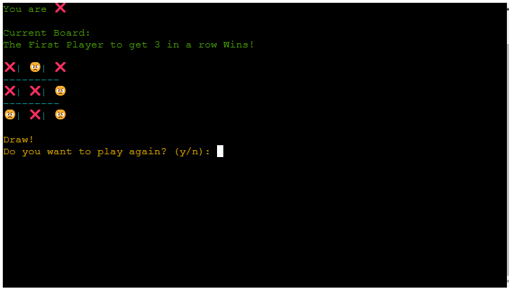

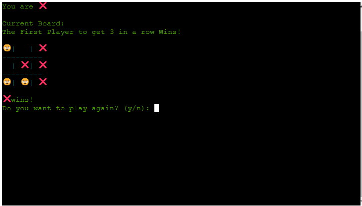

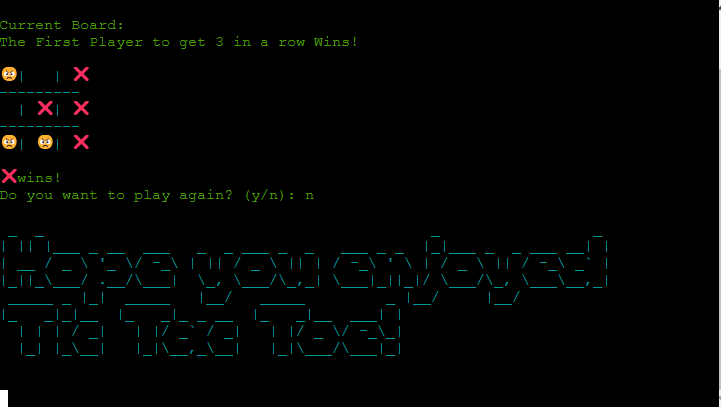

### Input Validation: ###

- It ensures that the player's input for their name and moves are valid.
- Name input only accepts alphabetic characters.
- Move input only accepts integers from 1 to 9 and checks if the chosen position is empty.

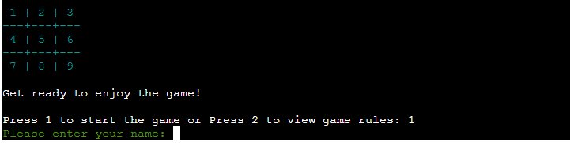

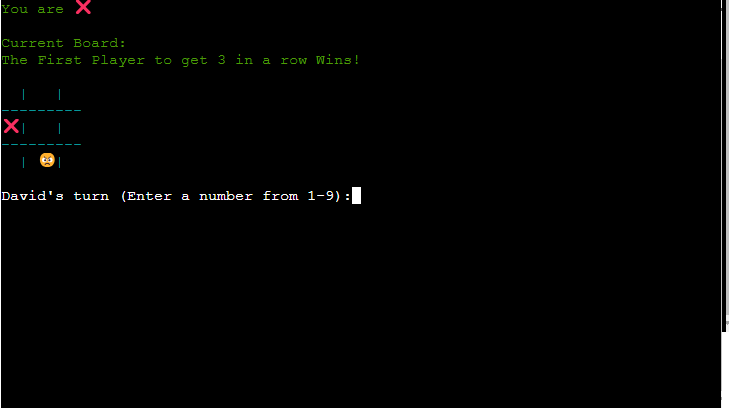

### Input Responses Error ###

- Press 1 and Press 2 if press 3 upward/special characters are Invalid choices.

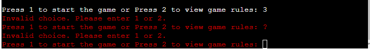

- Input for their name and enter by number and special characters are Invalid choices.

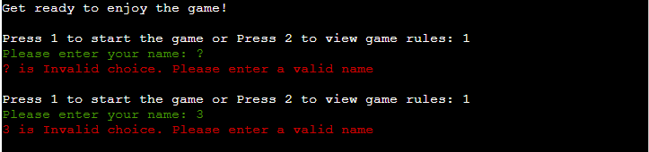

- Enter a number from 1-9 the cell is already occupied.

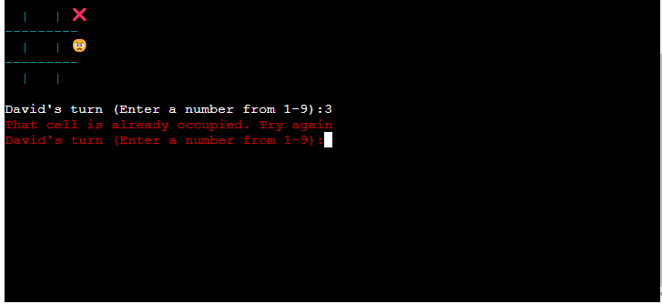

- Enter a number from 1-9, letters and special characters are Invalid input.

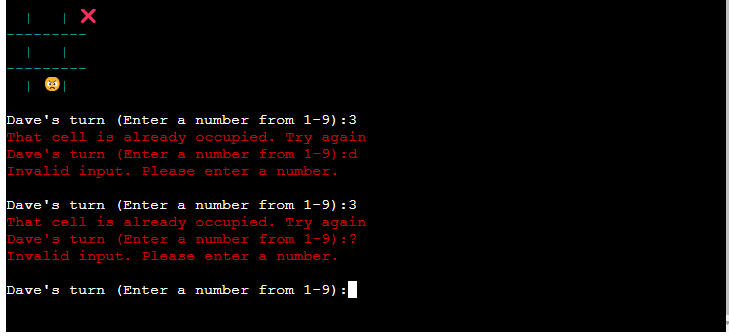

### Styling with Colorama: ###

- The colorama library is used for coloring the console output, enhancing the visual appeal of the game.
- Different colours are used for headers, prompts, and game status messages, making them more distinguishable and engaging.

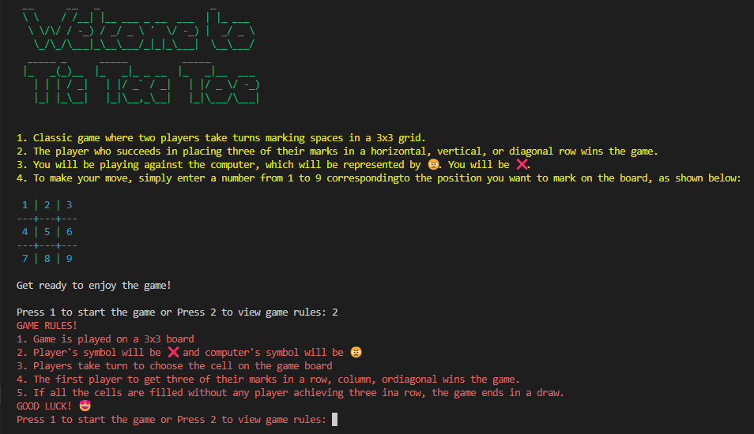

# Technologies Used #

## Languages Used ##

* [Python](https://www.python.org/)

## Tools ##

- The mentor recommended that we use YouTube to assist us with installing Colorama color into the game.
- [How to Print Colored Text in Python](https://www.youtube.com/watch?v=u51Zjlnui4Y)

    * Install Colorama using this terminal command: pip3 install colorama
    

    * When installing packages to be added to requirements.txt, type 'pip3 freeze > requirements.txt' in the terminal.
    [Pip Freeze > Requirements.txt](https://dev.to/eskabore/pip-freeze-requirementstxt-a-beginners-guide-5e2m)

    * To start the game, run the following command in terminal
    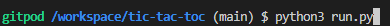
    [Run Python](https://pythonbasics.org/execute-python-scripts/)

## Frameworks - Libraries - Programs Used ##

* GitHub is a software hosting platform that enables users to store their projects in a remote location. This allows for easy access and collaboration on the project from different locations. [GitHub](https://www.github.com/)
* GitPod as developer hosting platform. [GitPod](https://www.gitpod.com)
* Heroku is a cloud platform as a service (PaaS) that allows developers to build, deploy, manage, and scale applications effortlessly. It provides a platform for hosting web applications, databases, and other software services, removing the need for developers to manage the underlying infrastructure. [Heroku](https://id.heroku.com/login)
* Perplexity Searching for useful and easy-to-explain. [Perplexity](https://www.perplexity.ai/)
* A CI (Continuous Integration) Python linter is a tool used in the context of Continuous Integration pipelines to check Python code for adherence to coding standards, best practices, and potential errors or style issues. [CI Python Linter](https://pep8ci.herokuapp.com/)
* Logo fonts generated using, Fonts name small [patorjk's Text to ASCII Art Generator](https://patorjk.com/software/taag/#p=testall&f=Impossible&t=Tic%20tac%20toe)
* Lucidchart is a web-based diagramming tool used for creating flowcharts, mind maps, organizational charts, network diagrams, and other types of visual representations. 
 [LucidChart](https://www.lucidchart.com/pages/)
* In the context of Tic Tac Toe, emojis can be used to represent the players' moves on the game board instead of traditional X's and O's. Emojis add a fun and visually appealing element to the game, making it more engaging for players. [Emoji](https://emojidb.org/tic-tac-toe-emojis)
* It helps users improve the quality and correctness of their written communication by identifying grammatical errors, spelling mistakes, punctuation issues, and style inconsistencies in their text. [Grammarly](https://www.grammarly.com/)
* Start reading the instructions on how to use Tic Tac Toe [Start reading Tic Tac Toe](https://medium.com/chat-gpt-now-writes-all-my-articles/creating-a-tic-tac-toe-game-in-python-859fbad07f30)
* Learned for .strip() and Enter the .strip() [Strip() Function](https://www.mygreatlearning.com/blog/strip-in-python/)
* How to use Python Raw String [Raw String](https://www.digitalocean.com/community/tutorials/python-raw-string)
* Code Institue Mentor recommended that OS Clear Screen [OS Clear Screen](https://www.geeksforgeeks.org/clear-screen-python/)

# Validator Testing #

## CI Python Linter ##

* I used CI Python Linter (https://pep8ci.herokuapp.com) to remove all errors from the code. The code is now error-free and optimized for performance.

# Future Plans #

In future updates of the Tic Tac Toe game,

* Integration with Goolge sheets: The highest scores from Tic Tac Toe games.
* Add a feature to display the highest score achieved by the player on the terminal interface. 
* Leaderboard feature where players can view the highest scores of all players who have played the game. This will competitive element to the game and motivate players to improve their skills.
* Additional difficulty levels for the Computer opponent.
* Play against a player and to be able to switch between playing against players 2 and computer.

# Bugs #

Solved bugs:

* Had few issues with indentations and was not able to run the code.
* Had a mistake in def move function which make my code run in the loop without moving to the next step in the game, took me a while to spot it.
* Had inputs were not handled properly, leading to unexpected behavior or crashes.
* Had Heroku bug and it is now fixed.
* Had Gitpod files problem and it is repaired by Code Institute Tutor Assistance and Heroku problem but it is repaired, Thanks to Code Institute Tutor Assitance.
* Please note there is one problem .gitpod.yml were missing files - no clue what happen there, I tried look up everything nothing can fix. 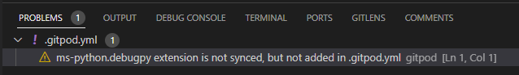

# Heroku Deployment

This project uses [Heroku](https://www.heroku.com), a platform as a service (PaaS) that enables developers to build, run, and operate applications entirely in the cloud.

Deployment steps are as follows, after account setup:

- Select **New** in the top-right corner of your Heroku Dashboard, and select **Create new app** from the dropdown menu.
- Your app name must be unique, and then choose a region closest to you (EU or USA), and finally, select **Create App**.
- From the new app **Settings**, click **Reveal Config Vars**, and set the value of KEY to `PORT`, and the value to `8000` then select *add*.
- Further down, to support dependencies, select **Add Buildpack**.
- The order of the buildpacks is important, select `Python` first, then `Node.js` second. (if they are not in this order, you can drag them to rearrange them)

Heroku needs three additional files in order to deploy properly.

- requirements.txt
- Procfile

You can install this project's **requirements** (where applicable) using:

- `pip3 install -r requirements.txt`

If you have your own packages that have been installed, then the requirements file needs updated using:

- `pip3 freeze --local > requirements.txt`

The **Procfile** can be created with the following command:

- `echo web: node index.js > Procfile`

# Local Deployment

This project can be cloned or forked in order to make a local copy on your own system.

For either method, you will need to install any applicable packages found within the *requirements.txt* file.

- `pip3 install -r requirements.txt`.

# Credits #

* [Youtube Python Tic Tac Toe Tutorial](https://www.youtube.com/watch?v=dK6gJw4-NCo&list=PLr66KBzyOhBXULXhbdP_Z5dGmSiI27fVc)
* [Start reading Tic Tac Toe 1](https://medium.com/chat-gpt-now-writes-all-my-articles/creating-a-tic-tac-toe-game-in-python-859fbad07f30)
* [Start reading Tic Tac Toe 2](https://inventwithpython.com/invent4thed/chapter10.html)
* [OS Clear Screen](https://www.geeksforgeeks.org/clear-screen-python/)
* [w3School for Name use isalpha](https://www.w3schools.com/python/ref_string_isalpha.asp)
* [Name 10 Character](https://realpython.com/len-python-function/)
* [Lowercase a String](https://www.freecodecamp.org/news/python-to-lowercase-a-string-str-lower-example/)
